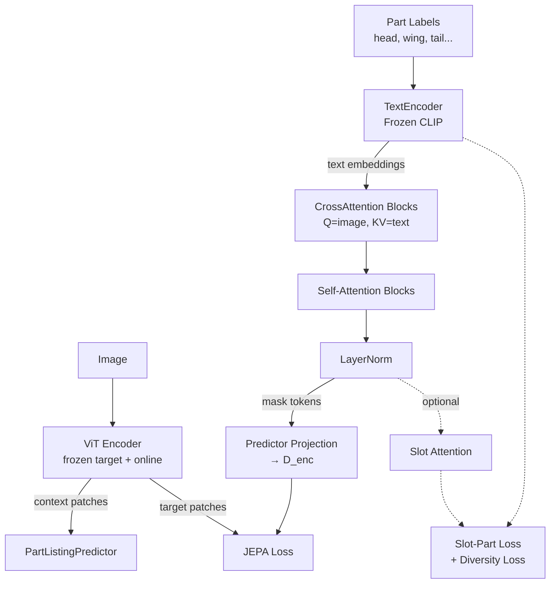

# Part-Listing I-JEPA

**Part-Listing I-JEPA** is an extension of the original **Image-based Joint-Embedding Predictive Architecture (I-JEPA)** that introduces **semantic part-listing abilities**. By integrating multimodally-conditioned cross-attention and object-centric slot attention, the model aligns visual patch representations with semantic part labels (e.g., from PartImageNet), enabling more semantically grounded and interpretable self-supervised learning.

[\[I-JEPA Paper (CVPR-23)\]](https://arxiv.org/pdf/2301.08243.pdf) [\[TI-JEPA Paper\]](d:\ijepa\TI_JEPA.pdf) [\[PartImageNet Dataset\]](https://arxiv.org/abs/2112.00933)

---

## Key Features

### 1. Semantic Part-Listing (TI-JEPA Inspired)
Introduces a **Text-Conditioned Predictor** that uses cross-attention to bridge the gap between image patches and part-label embeddings. 
- **Q**: Image context embeddings
- **K/V**: Part-label text embeddings (from a frozen CLIP encoder)
- This allows the predictor to become "aware" of the semantic parts it is expected to reconstruct in the latent space.

### 2. Object-Centric Slot Attention
Integrates an optional **Slot Attention** module within the predictor for unsupervised part decomposition.
- Competitive binding mechanism groups image tokens into a fixed set of "slots".
- Encourages the model to learn spatially coherent, object-centric representations.
- Optimized with a **Slot-Part Assignment Loss** (Hungarian Matching) and **Slot Diversity Loss**.

### 3. PartImageNet Alignment
Full support for the **PartImageNet** dataset, including:
- COCO-style annotation parsing.
- Supercategory-to-parts mapping (Quadruped, Bird, Car, Aeroplane, etc.).
- Custom collator for combined image-mask-label processing.

---

## Architecture



---

## Code Structure Extensions

The original I-JEPA codebase is preserved, with the following extensions:

```
.
├── src/models/
│   ├── cross_attention.py       # New: TI-JEPA-style multimodal fusion
│   ├── slot_attention.py        # New: Iterative competitive binding
│   ├── text_encoder.py          # New: CLIP-based part label encoder
│   └── part_listing_predictor.py # New: Unified predictor with slots/cross-attn
├── src/datasets/
│   └── part_listing_dataset.py  # New: PartImageNet integration
├── src/losses.py                # Updated: Slot assignment & diversity losses
├── src/part_listing_train.py     # New: Multi-modal training loop
├── main_part_listing.py         # New: Local entry point for part-listing
└── configs/
    └── part_listing_vitb16_ep100.yaml # New: Part-listing hyperparameters
```

---

## Quick Start

### 1. Requirements
- PyTorch 2.0+
- torchvision
- `transformers` (for CLIP text encoder)
- `pyyaml`, `numpy`, `scipy`

### 2. Launch Training
To run Part-Listing I-JEPA pre-training locally:
```bash
python main_part_listing.py \
  --fname configs/part_listing_vitb16_ep100.yaml \
  --devices cuda:0
```

### 3. Run Verification Tests
We provide a comprehensive test suite to verify the new modules:
```bash
python tests/test_part_listing.py
```

---

## License
See the [LICENSE](./LICENSE) file for details about the original I-JEPA license.

## Citation
If you use this part-listing extension, please cite both the original I-JEPA work and the relevant part-based architectures:

```bibtex
@article{assran2023self,
  title={Self-Supervised Learning from Images with a Joint-Embedding Predictive Architecture},
  author={Assran, Mahmoud and Duval, Quentin and Misra, Ishan and Bojanowski, Piotr and Vincent, Pascal and Rabbat, Michael and LeCun, Yann and Ballas, Nicolas},
  journal={arXiv preprint arXiv:2301.08243},
  year={2023}
}
```
